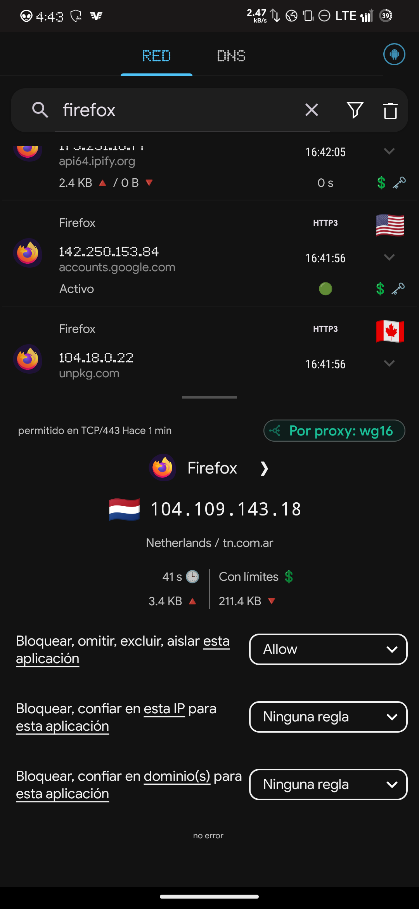
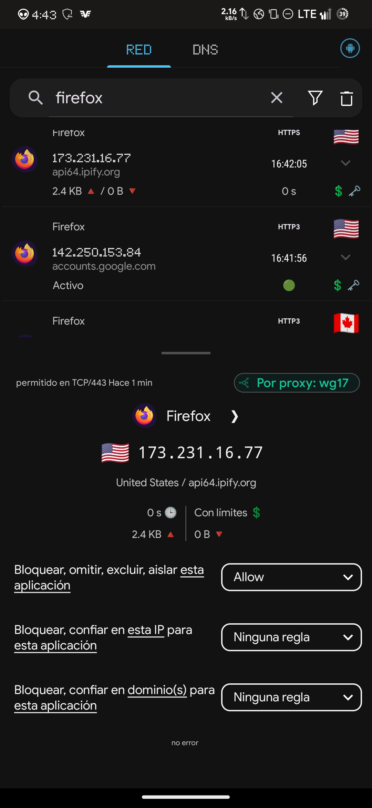
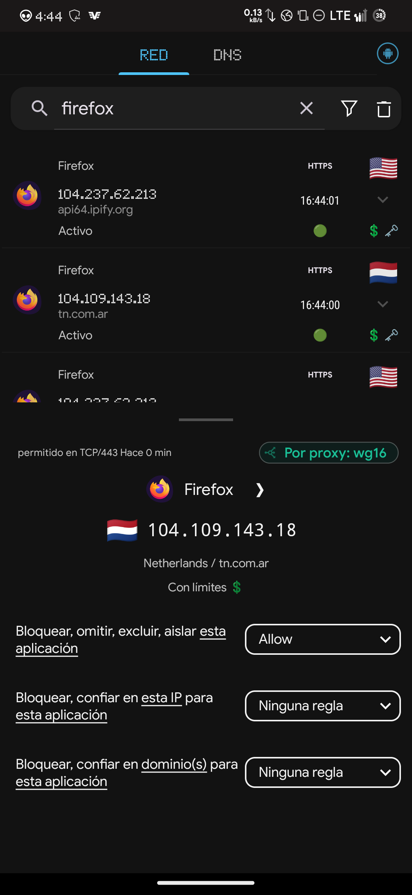
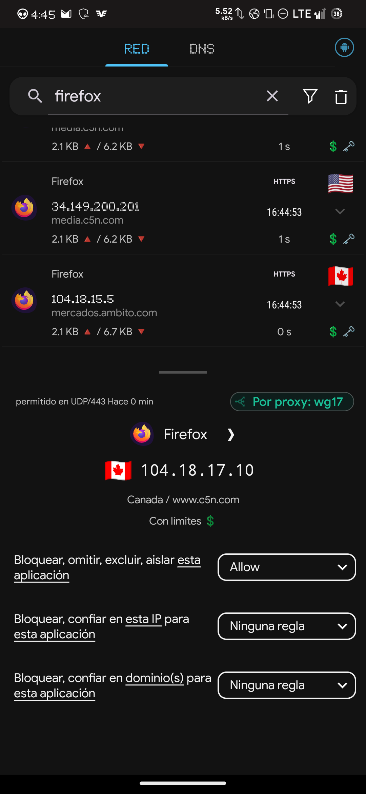
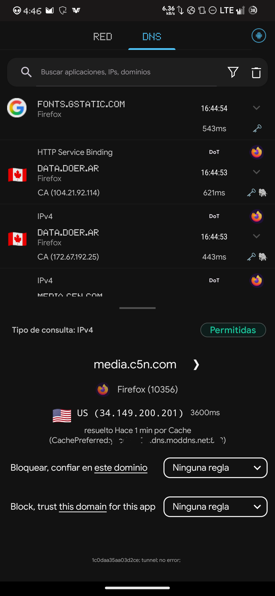
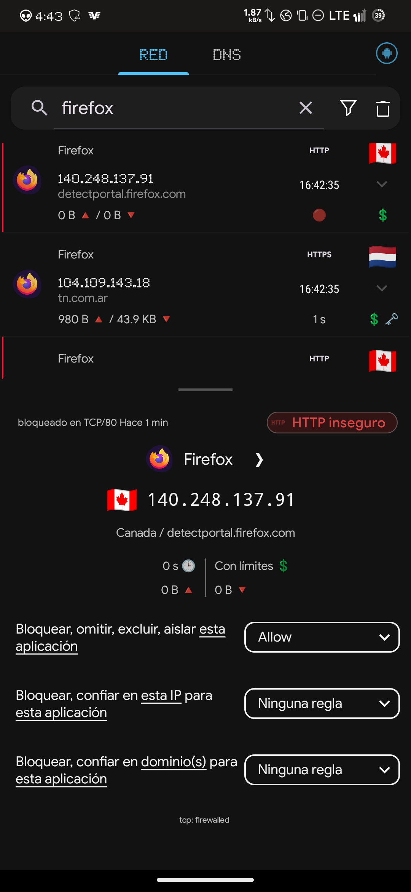

# VAL-002 — Network Transition & WireGuard Routing Validation

**Project:** Android OPSEC Hardening  
**Component:** RethinkDNS / WireGuard / DNS  
**Document Type:** Validation Report  
**Version:** 1.0  
**Status:** VALIDATED  
**Validation Date:** 2026-08-28  
**Last Reviewed:** 2026-09-02

---

## 1. Purpose

### Related Documents

- [ARCH-001 — RethinkDNS Architecture](../architecture/ARCH-001-rethinkdns-architecture.md)
- [ARCH-002 — Traffic Flow](../architecture/ARCH-002-traffic-flow.md)
- [VAL-001 — DNS Validation](VAL-001-dns-validation.md)

This document validates the behavior of the Android OPSEC networking architecture during network transitions and dynamic WireGuard proxy reassignment.

The primary objective was to determine whether RethinkDNS could correctly maintain traffic control while changing the WireGuard proxy used by applications according to the active network condition.

The validation focused on:

- WireGuard proxy reassignment.
- Network transition behavior.
- TCP and UDP traffic continuity.
- HTTP/3 traffic handling.
- DNS continuity during the transition.
- Firewall policy persistence.
- Detection of possible traffic bypasses.
- Detection of simultaneous or conflicting WireGuard routing.

This validation complements the DNS-specific methodology defined in [VAL-001 — DNS Validation](VAL-001-dns-validation.md).

VAL-001 focuses on DNS resolver, transport, routing, fallback, and continuity behavior. VAL-002 focuses on application routing and WireGuard proxy reassignment during network transitions.

---

## 2. Test Environment

### Device

Android device running the hardened networking configuration defined by the project architecture.

### Network Controller

RethinkDNS was responsible for:

- Application traffic interception.
- Firewall enforcement.
- DNS handling.
- WireGuard proxy routing.
- Per-application traffic visibility.

### Application Under Test

Mozilla Firefox was selected as the primary application for transition testing because it generates several useful traffic types:

- HTTPS over TCP/443.
- HTTP/3 / QUIC over UDP/443.
- DNS queries.
- Connectivity detection requests.
- Requests to external IP verification services.

### WireGuard Proxies

Two different WireGuard proxy states were observed during testing:

- `wg16`
- `wg17`

The proxies represented different routing states selected according to the active network configuration.

The purpose of the test was not to compare the VPN endpoints themselves, but to verify that RethinkDNS correctly reassigned new application connections when the network state changed.

---

## 3. DNS Configuration During Validation

During this particular validation session, the active DNS provider was:

**modDNS**

Transport:

**DNS-over-TLS (DoT)**

Port:

**TCP/853**

Observed resolver:

`<REDACTED>.dns.moddns.net:853`

The DNS provider had previously been changed from NextDNS to modDNS as part of a separate test and remained configured during this validation.

This does not invalidate the WireGuard transition test because DNS provider selection and WireGuard proxy routing represent separate components of the architecture.

Therefore:

- WireGuard transition behavior was validated independently.
- DNS continuity was validated using modDNS.
- NextDNS behavior was not evaluated during this specific test execution.

No claim regarding NextDNS continuity should therefore be derived from this validation session.

---

## 4. Validation Methodology

The test consisted of generating active network traffic with Firefox while triggering network/proxy transitions.

RethinkDNS network and DNS logs were monitored during the process.

The following indicators were examined:

1. Active WireGuard proxy.
2. Destination IP address.
3. Destination domain.
4. Transport protocol.
5. Destination port.
6. DNS resolver.
7. Firewall decisions.
8. Connection status.
9. Traffic generated immediately before and after proxy transitions.

Several independent destinations were used to avoid relying on a single service or connection.

---

## 5. WireGuard Transition Results

The logs demonstrated traffic being assigned to both WireGuard routing states at different stages of the transition.

### 5.1 Initial State — wg16

Firefox traffic to `tn.com.ar` was observed being explicitly routed
through the WireGuard proxy identified by RethinkDNS as `wg16`.

Observed destination:

`104.109.143.18`

Transport:

`TCP/443`

RethinkDNS reported:

`Por proxy: wg16`



**Observed result: PASS**

The observation confirms that Firefox traffic was assigned to `wg16`
during the initial routing state.

### 5.2 Transition — wg17

Following the network/proxy transition, Firefox generated a new
connection to:

`api64.ipify.org`

Observed destination:

`173.231.16.77`

Transport:

`TCP/443`

RethinkDNS reported:

`Por proxy: wg17`



**Observed result: PASS**

The connection provides evidence that newly generated Firefox traffic
was reassigned from `wg16` to `wg17`.

Observed transition:

`wg16 → wg17`

### 5.3 Return Transition — wg16

Firefox was subsequently observed using `wg16` again.

A connection to:

`tn.com.ar`

was reported by RethinkDNS as:

`Por proxy: wg16`



**Observed result: PASS**

The complete observed routing sequence was therefore:

`wg16 → wg17 → wg16`

This demonstrates that the observed behavior was not limited to a
single one-way proxy transition.

---

## 6. UDP / HTTP3 Validation

The validation was not limited to TCP traffic.

Firefox generated **UDP/443** traffic associated with the observed **HTTP/3 flow**.

One observed destination was:

`www.c5n.com`

Destination IP:

`104.18.17.10`

RethinkDNS reported:

`Por proxy: wg17`

Status:

`Allowed`



This demonstrates that WireGuard reassignment remained functional for **UDP/443** traffic associated with the observed **HTTP/3** flow and was not restricted to conventional HTTPS connections over TCP.

### Result

**PASS**

Both major web transport paths were observed:

- TCP/443
- UDP/443

---

## 7. DNS Continuity

DNS activity remained observable across the tested transition sequence, with resolution continuing through the configured modDNS resolver.



RethinkDNS showed DNS requests using:

`DoT`

with the configured modDNS resolver:

`<REDACTED>.dns.moddns.net:853`

Example:

`media.c5n.com`

resolved to:

`34.149.200.201`

The resolver information reported:

`CachePreferred:<REDACTED>.dns.moddns.net:853`

Other domains observed during the test included:

- `tn.com.ar`
- `mercados.ambito.com`
- `media.c5n.com`
- `www.c5n.com`
- `www.youtube.com`
- `imasdk.googleapis.com`
- `api.onesignal.com`

DNS resolution therefore remained operational while the WireGuard routing state changed.

### Result

**PASS**

No evidence of DNS fallback to the mobile network resolver was observed in the collected RethinkDNS logs.

---

## 8. HTTPS / SVCB Queries

Some DNS queries of type:

`HTTP Service Binding`

were displayed as:

`Sin respuesta`

Examples included:

`www.c5n.com`

and:

`tn.com.ar`

These events did not represent a general DNS failure.

IPv4 resolution for the corresponding services continued successfully and subsequent HTTPS/HTTP3 connections were established.

HTTP Service Binding queries are associated with HTTPS/SVCB service discovery and may legitimately return no usable record depending on the authoritative DNS configuration.

Therefore these events were not classified as transition failures.

---

## 9. Firewall Persistence

The test also provided evidence that RethinkDNS firewall policies remained active during the network transition.



Firefox attempted to contact:

`detectportal.firefox.com`

Destination:

`140.248.137.91`

Protocol:

`HTTP`

Port:

`TCP/80`

RethinkDNS blocked the request and reported:

`HTTP inseguro`

and:

`tcp: firewalled`

Traffic counters showed:

`0 B / 0 B`

This behavior matches the project's firewall policy that blocks insecure HTTP traffic on TCP port 80.

The observed network transition did not result in loss of enforcement of the tested firewall rule.

### Result

**PASS**

---

## 10. Destination Geolocation

RethinkDNS displayed different country indicators for remote destinations during testing.

Examples included:

- United States
- Canada
- Netherlands

These indicators correspond to the geolocation of the destination IP address and must not be interpreted as the physical location of the active WireGuard VPN endpoint.

For example:

```
Firefox
   |
   v
RethinkDNS
   |
   +---- wg16 ----> Internet ----> Destination A
   |
   +---- wg17 ----> Internet ----> Destination B
```

Destination geolocation and VPN exit-node geolocation represent different properties.
WireGuard routing validation therefore relied on RethinkDNS proxy attribution and external IP verification rather than destination-country indicators.

---

## 11. Conflict Analysis

A critical objective of the test was to determine whether multiple WireGuard proxies could incorrectly compete for Firefox traffic during the transition.

The expected problematic behavior would have been:
```
Network transition
       |
       +---- new traffic -> wg17
       |
       +---- new traffic -> wg16
                ^
                |
          unexpected
```
This behavior was not observed.
Instead, new connections were consistently associated with the WireGuard proxy corresponding to the observed routing state.
No evidence was found of uncontrolled simultaneous routing through both proxies for newly generated Firefox connections.

### Result

**PASS**

---

## 12. Leak Analysis

The collected evidence did not show application traffic bypassing the configured WireGuard proxy during the observed test intervals.

Likewise, no DNS fallback to an unexpected resolver was visible in the collected RethinkDNS logs.

However, this distinction is important:

The current validation demonstrates correct functional behavior at the RethinkDNS logging and routing level.

It does not constitute packet-level proof that zero packets could escape during the exact milliseconds in which a network interface changes state.

A definitive packet-level leak analysis would require additional instrumentation such as:

- PCAP capture.
- Controlled VPN failure.
- Interface-level traffic monitoring.
- Dedicated kill-switch testing.

Consequently, the result should be interpreted as:

No bypass observed

rather than:

Cryptographic or packet-level proof of zero possible bypass

This distinction prevents the validation from making claims beyond the collected evidence.

---

## 13. Validation Matrix

| Test                               | Result       |
| ---------------------------------- | ------------ |
| WireGuard proxy transition         | PASS         |
| wg16 routing                       | PASS         |
| wg17 routing                       | PASS         |
| Return transition                  | PASS         |
| TCP/443 continuity                 | PASS         |
| UDP/443 continuity                 | PASS         |
| HTTP/3 operation                   | PASS         |
| DNS continuity                     | PASS         |
| modDNS over DoT                    | PASS         |
| Firewall persistence               | PASS         |
| TCP/80 blocking                    | PASS         |
| Unexpected simultaneous WG routing | NOT OBSERVED |
| Application proxy bypass           | NOT OBSERVED |
| DNS fallback                       | NOT OBSERVED |
| NextDNS during this execution      | NOT TESTED   |
| Packet-level zero-leak guarantee   | OUT OF SCOPE |

---

## 14. Final Assessment

The network transition architecture behaved according to the expected design.

RethinkDNS successfully maintained application traffic control while the active WireGuard routing state changed.

The collected evidence demonstrates:

- Successful routing through multiple WireGuard proxy states.
- Correct reassignment of new application connections.
- Continued operation of TCP and UDP traffic.
- Successful HTTP/3 traffic through the selected proxy.
- Continued DNS resolution through the configured DoT resolver.
- Persistence of firewall policy during network changes.
- No observed uncontrolled routing conflict between WireGuard proxies.
- No observed DNS fallback.
- No observed application traffic bypass in the collected logs.

The DNS provider used during this validation was modDNS rather than NextDNS. This difference does not affect the WireGuard transition result because DNS provider selection and WireGuard proxy routing were evaluated as separate architectural layers.

---

## 15. Validation Status

FINAL RESULT: **PASS**

Status: **VALIDATED**

The WireGuard network transition mechanism is considered functionally validated for the tested configuration.

No additional repetition of this test using NextDNS is required to validate the WireGuard transition itself.

A separate NextDNS/modDNS comparison may be performed in the future if DNS-provider-specific transition behavior becomes part of the validation scope.

---

## 16. Evidence

Validation evidence was collected from RethinkDNS network and DNS logs
on 2026-08-28.

| ID | Evidence | Purpose |
|---|---|---|
| E01 | `VAL-002-E01-wg16-initial-routing.png` | Initial Firefox routing through `wg16` |
| E02 | `VAL-002-E02-wg17-transition.png` | Firefox reassignment to `wg17` |
| E03 | `VAL-002-E03-wg16-return-routing.png` | Return routing through `wg16` |
| E04 | `VAL-002-E04-http80-firewall-block.png` | TCP/80 firewall enforcement |
| E05 | `VAL-002-E05-http3-udp443-wg17.png` | UDP/443 traffic through `wg17` |
| E06 | `VAL-002-E06-moddns-dot-resolution.png` | modDNS resolution over DoT |

Evidence directory:

`evidence/VAL-002/`

---

Validation ID: VAL-002
Result: **PASS**
State: **CLOSED / VALIDATED**
