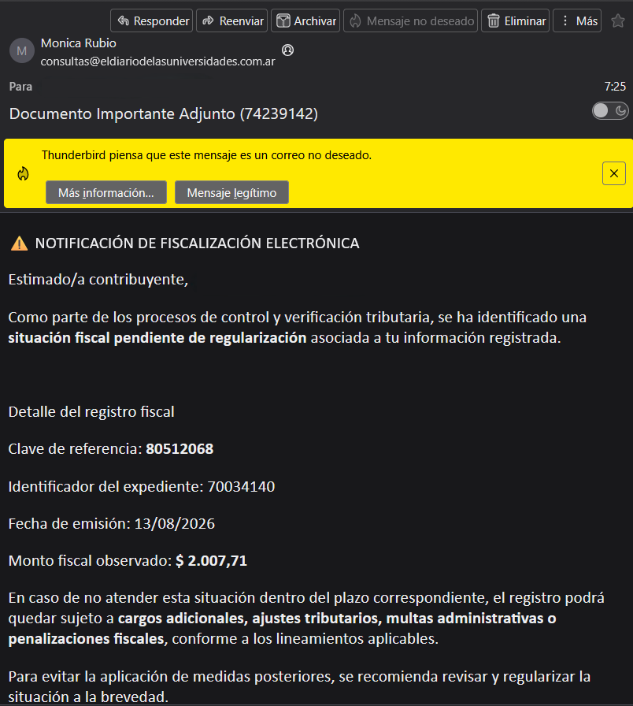
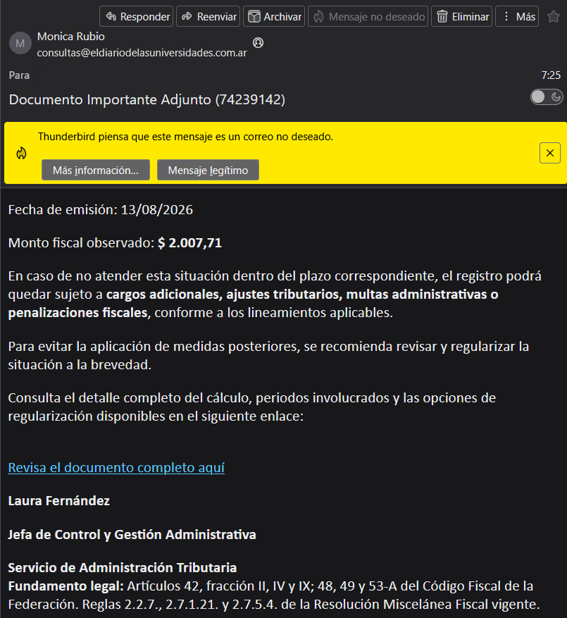
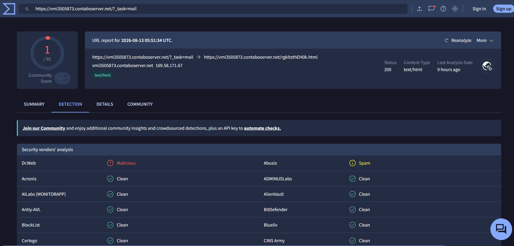
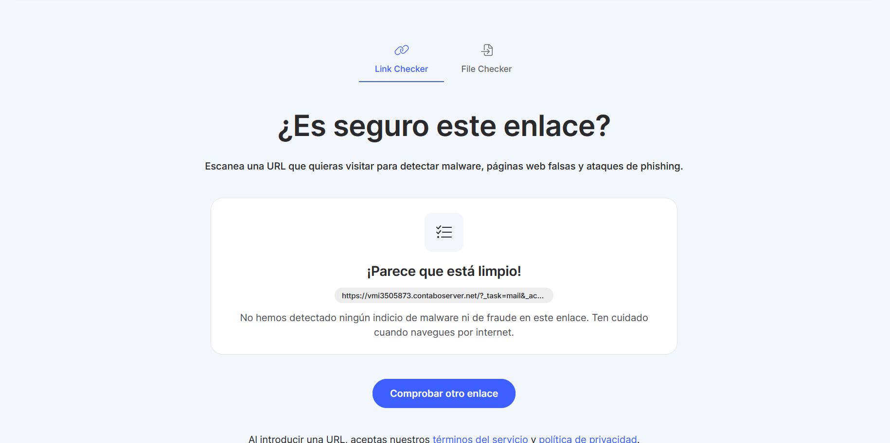

# Case Study: Detection False Negative — Compromised Contabo VPS Serving Phishing Content

**Status:** 🟡 Pending response from Nord Security (reported 2026-08-14)
**Last updated:** 2026-08-14

---

## 1. Summary

Analysis of a phishing email received in the wild, with cross-verification across multiple URL detection engines. This case documents a detection gap between security tools evaluating the same indicator of compromise (IoC), and the responsible disclosure process followed with one of the vendors involved.

## 2. The Vector: Phishing Email

- **Subject:** "Documento Importante Adjunto (74239142)" ("Important Attached Document")
- **Spoofed sender:** `consultas@eldiariodelasuniversidades.com.ar` (a university news outlet domain, unrelated to tax matters — likely a legitimate domain either compromised or with weak SPF/DKIM, abused for sender spoofing)
- **Low-sophistication tell (template mismatch):** the message body invokes Mexico's **Código Fiscal de la Federación** (federal tax code, citing articles 42, 48, 49 and 53-A) while targeting a recipient with an Argentine `.com.ar` address. This jurisdictional inconsistency is a strong indicator that the message uses a generic phishing template, reused without adapting it to the intended audience.
- **Pretext:** a fake "electronic tax audit" notice with a fabricated reference number and amount owed, pressuring the recipient to click a link ("Revisa el documento completo aquí" — "Review the full document here") before "administrative penalties" apply.
- **Destination URL (defanged):** `hxxps://vmi3505873[.]contaboserver[.]net/?_task=mail&_action=get&_mbox=INBOX&_uid=766551&_token=[REDACTED]&_part=1.2.663&_embed=1&_mimeclass=image`

*Figure 1. Email body impersonating a tax authority, invoking the wrong jurisdiction's legal code for the recipient's country.*

*Figure 2. Call-to-action link ("Revisa el documento completo aquí") pointing to the Contabo-hosted Roundcube endpoint.*

## 3. Technical Analysis of the URL

The URL structure matches the attachment-download endpoint of **Roundcube webmail** (`_task=mail&_action=get`), not a public landing page. This indicates the link points to embedded content (an image) within a mailbox hosted on a Contabo VPS — consistent with one of two typical scenarios:
1. A legitimate but compromised Roundcube instance, repurposed by the attacker to host/serve campaign content.
2. Phishing infrastructure deployed directly on a VPS rented under a false identity.

**OSINT correlation:** prior reports were identified in the **ANY.RUN** sandbox for other URLs sharing the **identical structure** (`vmi*.contaboserver.net/?_task=mail&_action=get...&_mimeclass=image`), pointing to different VPS instance numbers, and already classified as phishing activity. This suggests a recurring pattern rather than an isolated incident — likely automation or infrastructure reuse by the same actor or phishing kit.

The root domain `contaboserver.net` is itself **legitimate VPS hosting** (Contabo is a real hosting provider). The risk is localized to the specific subdomain/VPS instance, not the provider as a whole.

## 4. Cross-Verification of Detection

| Source | Result | Detail |
|---|---|---|
| VirusTotal | ⚠️ Flagged | 1/92 engines — Dr.Web: *Malicious*, Abusix: *Spam* |
| Other scanners (~10 tools sampled) | ⚠️ Partially flagged | ~2/10 classify it as spam/suspicious |
| ANY.RUN (historical) | ⚠️ Confirmed | URLs with the identical structure already catalogued as phishing |
| Nord Security — Link Checker | ✅ "Looks clean" | False negative |

*Figure 3. VirusTotal report: Dr.Web (Malicious) and Abusix (Spam) flag the URL; the remaining 90 engines return clean.*

*Figure 4. Nord Security's Link Checker classifies the same URL as clean — the false negative reported to the vendor.*

**Honest read of the finding:** no single engine shows majority consensus — detection ratios are low across every tool tested. The "phishing" conclusion doesn't rest on any one scanner's score; it rests on **triangulation**: pretext coherence + a URL structure already documented as malicious in a separate context (ANY.RUN) + negative reputation of the domain across abuse-tracking sources. This is precisely the methodological point of the case: automated detection alone, even when aggregated, isn't always sufficient — manual pattern analysis still matters.

## 5. Responsible Disclosure

- **Channel used:** the "Report inaccurate detection" form on Nord Security's Link Checker (not the HackerOne bug bounty program — that program is scoped to technical vulnerabilities in software/infrastructure, not URL-reputation gaps, so it didn't apply here).
- **Report contents:** full URL, VirusTotal detection ratio, reference to prior ANY.RUN findings, and a suggestion to flag the specific VPS instance without affecting Contabo's overall domain reputation.
- **Date submitted:** 2026-08-14.
- **Status as of this entry:** no response yet. This is not read as a lack of diligence on Nord's part — triage timelines for reputation reports (as opposed to critical vulnerabilities) commonly run from days to weeks.

## 6. Pending / Next Update

- [ ] Response from Nord Security (confirmation, detection fix, or report rejection)
- [ ] Verify whether the URL is still active or has been taken down
- [ ] (Optional) Equivalent report to other providers showing the same false negative

*This section will be updated with date and outcome once there is news.*

## 7. Methodological Takeaway

Don't rely on a single detection engine, even one from a well-known security vendor. At minimum, cross-check: (1) a multi-engine aggregator like VirusTotal, (2) sandbox history (ANY.RUN, urlscan.io), (3) coherence analysis of the email/pretext content itself, and (4) domain/infrastructure reputation. Responsible disclosure — reporting through the correct channel, with verifiable evidence, without exposing third-party personal data — is an integral part of the process, not an optional step.

---
*Indicators of compromise (IoCs) documented in defanged format. Original recipient's personal data redacted for privacy.*
